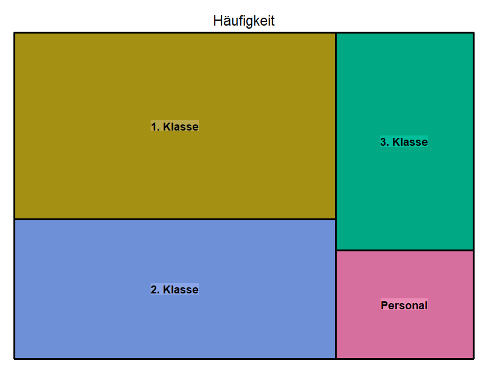

```{r setup, include=FALSE}
library(learnr)
knitr::opts_chunk$set(echo = TRUE)
```

## Einführung

```{r intro, echo=FALSE}
shiny::tabsetPanel(
  id = "myAccordion",
  # Panel 1
  shiny::tabPanel(
    title = "Start",
    value = "panel1",
    htmltools::HTML("
      <p>Das Einkaufsteam einer Edinburger Bäckerei hat bei der Einkaufsplanung und Überprüfung gemerkt, dass bestimmte Produktgruppen in den letzten Monaten deutlich öfter als andere nachgekauft werden müssen, während andere ab und zu verderben bzw. weggeworfen werden müssen, weil sie schon über dem Verfalldatum sind. Dadurch entstehen Kosten und die Bäckerei verliert das Geld, das sonst dem Modernisierungswunsch des Geschäftsführers zufolge in die Erneuerung der Innenausstattung investiert werden könnte.</p>
      <p>Das Einkaufsteam hat in Kooperation mit dem Verkaufsteam bestimmte Verhaltensmuster der Käufer/innen vermutet und möchte ihre Behauptungen nun überprüfen. Zum Glück haben die Bäckereimitarbeiter/innen alle Transaktionen sorgfältig im Transaktionsmanagement-System abgespeichert, so dass alle Daten zu den Transaktionen zwischen dem 01.11.2016 und 30.03.2017 zur Verfügung stehen und zwar:</p>
      <ul>
        <li>Transaktionsnummer,</li>
        <li>Name der Ware,</li>
        <li>Transaktionsdatum und -uhrzeit,</li>
        <li>Tageszeit,</li>
        <li>Wochentag/Wochenende.</li>
      </ul>
      
      <p>Überlege dir, wie die Bäckereimitarbeiter/innen ihre Analyse durchführen und nach Kaufmustern suchen könnten und klicke dann auf die Reiter, um Einblicke in den Analyseprozess vom Einkaufsteam zu bekommen.</p>
    ")
  ),
  # Panel 2
  shiny::tabPanel(
    title = "Zusammenhänge zwischen Produkten",
    value = "panel2",
    htmltools::HTML("
      <p>This is the content for Panel 2.</p>
      
      <ol>
        <li>First item</li>
        <li>Second item</li>
        <li>Third item</li>
      </ol>
      
      <p>You can also create nested lists:</p>
      
      <ul>
        <li>First level
          <ul>
            <li>Second level
              <ul>
                <li>Third level</li>
              </ul>
            </li>
          </ul>
        </li>
      </ul>
    ")
  ),
  # Panel 3
  shiny::tabPanel(
    title = "Panel 3",
    value = "panel3",
    htmltools::HTML("
      <p>This is the content for Panel 3.</p>
      
      <blockquote>
        <p>This is a blockquote.</p>
      </blockquote>
      
      <p>You can include code snippets as well:</p>
      
      <pre><code>
# Example code
x <- 1:10
mean(x)
      </code></pre>
    ")
  )
)
```

## Bedingte relative Häufigkeiten

Die Mitarbeiter/innen der Bäckerei haben in ihrer Analyse bedingte relative Häufigkeiten benutzt. Was ist das aber?

Die Häufigkeitsverteilung spielt in der Statistik eine große Rolle. Du weißt bestimmt schon über absolute und relative Häufigkeiten. Die letzten können weiterhin in bedingte relative Häufigkeiten umgewandelt werden.

**Bedingte relative Häufigkeiten werden als Verhältnis der Anzahl der Fälle, in denen ein bestimmtes Ereignis $A$ auftritt, unter der Bedingung, dass ein anderes Ereignis $B$ bereits eingetreten ist, zur Gesamtanzahl der Fälle, in denen Ereignis $B$ eingetreten ist, definiert.** Diese Definition lässt sich durch die folgende Formel mathematisch ausdrücken:

\[
P(A \big| B) = \frac{P(A \cap B)}{P(B)},
\]
wo $P(A \big| B)$ für die bedingte relative Häufigkeit von $A$ unter der Bedingung $B$, $P(A \cap B)$ für die Wahrscheinlichkeit, dass sowohl $A$ als auch $B$ eintreten und $P(B)$ für die Wahrscheinlichkeit des Eintretens von $B$ steht.

Bedingte relative Häufigkeiten werden häufig für die Analyse und Interpretation von Daten verwendet. Sie helfen uns, Beziehungen zwischen Ereignissen zu untersuchen und zu bestimmen, ob bestimmte Faktoren voneinander abhängig sind oder nicht.

Dies findet eine praktische Anwendung in verschiedenen Bereichen. In der *Medizin* kann z.B. der Effekt einer Behandlung unter Berücksichtigung bestimmter Risikofaktoren eingeschätzt werden und in der *Wirtschaft* kann das Verbraucherverhalten in Bezug auf bestimmte Produkte analysiert werden.

Im nächsten Abschnitt lernst du noch einen Datensatz kennen, bei dem du mithilfe bedingter relativer Häufigkeiten bestimmte Vorhersagen treffen kannst. Dieser Datensatz wird dich auch weiterhin begleiten, als du mehr über graphische Darstellungen von bedingten relativen Häufigkeiten erfährst.

## Use Case: Titanic

Am 15. April 1912 ist das vermeintlich sicherste Schiff der Epoche *Titanic* auf einen Eisberg gestoßen und demzufolge versunken. Da unzureichend Rettungsboots an Bord waren, sind viele Menschen ums Leben gekommen - 1502 von 2224 Passagieren und Schiffsleuten sind tragisch gestorben.

Man kann das Überleben einiger Passagiere zwar mit ihrem Glück verbinden, es konnte aber bestimmte Umstände geben, unter denen die eine oder andere Person mehr Überlebenschancen hatte als andere. Diese Hypothese kann anhand des folgenden Datensatzes überprüft werden.

Führe den Code unten aus, um mehr über die Tabelle zu erfahren, die wir des Weiteren benutzen werden. Sei frei, auch weitere Befehle zu schreiben und auszuführen, z.B. $head(Titanic)$, um den Datensatz noch besser kennenzulernen.

```{r dataset, exercise = TRUE}
summary(Titanic)  # achte auf die Anzahl der Reihen und Spalten
str(Titanic)  # ein Überblick von Spaltennamen und Ausprägungen der Werte
```

## Häufigkeitsbäume

Bedingte relative Häufigkeiten lassen sich mit Hilfe von **Häufigkeitsbäumen**, manchmal auch als **Baumdiagramme** oder als **Wahrscheinlichkeitsbäume** genannt, visualisieren.

Wie der Name schon verrät, hat diese Visualisierung eine Form vom Baum - es gibt:

- eine **Wurzel** - einen Ausgangspunkt des Baumdiagramms,
- **Äste** oder **Zweige** - Abspaltungen aus den Knotenpunkten, die eine Bedingung oder Entscheidung widerspiegeln, die zu einem bestimmten Ereignis führt,
- und schließlich **Blätter** - finale Ergebnisse, zu denen eine Reihe von verschiedenen möglichen Ereignissen geführt hat.

Den Knotenpunkten kann man qualitative Zustände ablesen, die durch vorherige Ereignisse zustande gekommen sind, und die Zweige werden mit prozentualen Werten beschriften, die zeigen, wie wahrscheinlich das eine oder das andere Szenario ist.

```{r fig1, echo = FALSE, out.width = "100%", fig.cap = "Auf dieser Grafik sieht man, wie sich alle Menschen auf Titanic in die Kategorien nach der Passagierklasse verteilt haben und welcher Prozent von der jeweiligen Kategorie überlebt oder nicht überlebt hat."}
knitr::include_graphics("images/sex_tree.png")
```

Klicke weiter, um zu lernen, wie man Häufigkeitsbäume liest und erstellt.

## Häufigkeitsbäume lesen

Einleitung

```{r fig2, echo = FALSE, out.width = "100%", fig.cap = "Hier sieht man schon die Verteilung nach der Passagierklasse und Alterskategorie und dann die Überlebungsquote."}
knitr::include_graphics("images/class_age_treemap.png")
```

Aufgaben

## Häufigkeitsbäume erstellen

Einleitung

```{r fig3, echo = FALSE, out.width = "100%", fig.cap = "Auf dieser Grafik werden die Verteilung nach Alter und die Überlebungsquote gezeigt. Was soll laut der Beschreibung oben in den Lücken stehen?"}
knitr::include_graphics("images/age_treemap_gaps.png")
```

!!! Exercise!!!

Aufgaben

```{r fig4, echo = FALSE, out.width = "100%", fig.cap = "Lösungserklärung"}
knitr::include_graphics("images/age_treemap.png")                                # aufklappbar machen
```

In dieser Übung wurden nicht alle Knoten beschriftet. Wie wäre es, wenn nicht alle Prozentwerte bei den Ästen angegeben werden?

```{r fig5, echo = FALSE, out.width = "100%", fig.cap = "Auf dieser Grafik wird wieder die Verteilung nach Geschlecht und die Überlebungsquote gezeigt, aber diesmal ohne einige Angaben zu Häufigkeiten. Kannst du die Lücken ausfüllen?"}
knitr::include_graphics("images/sex_treemap_gaps.png")
```

```{r fig6, echo = FALSE, out.width = "100%", fig.cap = "Lösungserklärung"}
knitr::include_graphics("images/sex_treemap.png")                                # aufklappbar machen
```

## Mosaikplot

Eine weitere graphische Darstellung von bedingten relativen Häufigkeiten sind **Mosaikplots**.

...

```{r fig7, echo = FALSE, out.width = "100%", fig.cap = "Auf dieser Grafik sieht man, wie sich alle Menschen auf Titanic in die Kategorien nach der Passagierklasse verteilt haben und welcher Prozent von der jeweiligen Kategorie überlebt oder nicht überlebt hat."}

```

...

Klicke weiter, um zu lernen, wie man Häufigkeitsbäume liest und erstellt.

## Mosaikplot lesen

Einleitung - Bild - Aufgaben

## Mosaikplot erstellen

Einleitung - Bild - Aufgaben + R Code

## Zusammenfassung

## Quiz
Teste jetzt deine Kenntnisse!

```{r quiz1, echo=FALSE}
#quiz(caption = "1. Definition",
#     question_radio("Was sind bedingte relative Häufigkeiten?",
#                    answer_fn("a", correct = TRUE, message = "richtig"),
#                    answer_fn("b", correct = FALSE, message = "falsch")))
```

```{r quiz2, echo=FALSE}
#quiz(caption = "2. Anwendungsbereiche",
#     question_checkbox("In welchen Fällen werden bedingte relative Häufigkeiten angewendet?",
#                       answer_fn("a", correct = TRUE)))
```

(praktische Aufgaben 3-6)

## Programmieraufgaben

## Feedback
Danke erstmal für die Benutzung dieser E-Learning Plattform, hoffentlich kannst du das Thema bedingte relative Häufigkeiten nun deutlich besser verstehen.

Damit deine Erfahrung mit der upgradeten Version dieser oder mit einer weiteren Plattform noch besser wird, möchte ich dich bitten, zum Abschluss an einer kleinen Umfrage teilzunehmen. Die Umfrage ist anonym und die erhobenen Daten werden ausschließlich zu Forschungszwecken verwendet.

(klick auf Start)


```{r saveanswers, echo=FALSE}
library(readr)

# Get user's answers
answers <- c(
  0,#question1 = input$question1, 
  1,#question2 = input$question2,
  2#question3 = input$question3
)
answers_dt <- data.frame(answers)

# Save answers to a CSV file
write_csv(answers_dt, "answers.csv")
```
