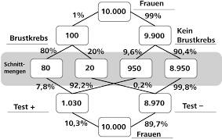

```{r setup, include=FALSE}
library(learnr)
knitr::opts_chunk$set(echo = TRUE)
```

## Einführung


## Bedingte relative Häufigkeiten

text

## Use Case: Titanic

## Häufigkeitsbäume

Bedingte relative Häufigkeiten lassen sich mit Hilfe von **Häufigkeitsbäumen**, manchmal auch als **Baumdiagramme** oder als **Wahrscheinlichkeitsbäume** genannt, visualisieren.

Wer der Name schon verrät, hat diese Visualisierung eine Form vom Baum - es gibt

- eine **Wurzel** - ...
- **Zweige** - ...
- und schließlich **Blätter** - ...

```{r fig1, echo = FALSE, out.width = "100%", fig.cap = "Auf dieser Grafik ... ."}

```

Klicke weiter, um zu lernen, wie man Häufigkeitsbäume liest und erstellt.

## Häufigkeitsbäume lesen

Einleitung - Bild - Aufgaben

## Häufigkeitsbäume erstellen

Einleitung - Bild - Aufgaben

## Mosaikplot

Eine weitere graphische Darstellung von bedingten relativen Häufigkeiten sind **Mosaikplots**.

...

Bild

...

Klicke weiter, um zu lernen, wie man Häufigkeitsbäume liest und erstellt.

## Mosaikplot lesen

Einleitung - Bild - Aufgaben

## Mosaikplot erstellen

Einleitung - Bild - Aufgaben + R Code

## Zusammenfassung

## Quiz

## Programmieraufgaben

## Feedback

