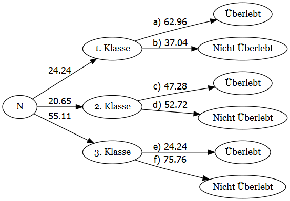

```{r setup, include=FALSE}
library(learnr)
library(graphics)
knitr::opts_chunk$set(echo = TRUE)
```

## Einführung

```{r intro, echo=FALSE}
shiny::tabsetPanel(
  id = "myAccordion",
  # Panel 1
  shiny::tabPanel(
    title = "Start",
    value = "panel1",
    htmltools::HTML("
      <p>Das Einkaufsteam einer Edinburger Bäckerei hat bei der Einkaufsplanung und Überprüfung gemerkt, dass bestimmte Produktgruppen in den letzten Monaten deutlich öfter als andere nachgekauft werden müssen, während andere ab und zu verderben bzw. weggeworfen werden müssen, weil sie schon über dem Verfalldatum sind. Dadurch entstehen Kosten und die Bäckerei verliert das Geld, das sonst dem Modernisierungswunsch des Geschäftsführers zufolge in die Erneuerung der Innenausstattung investiert werden könnte.</p>
      <p>Das Einkaufsteam hat in Kooperation mit dem Verkaufsteam bestimmte Verhaltensmuster der Käufer/innen vermutet und möchte ihre Behauptungen nun überprüfen. Zum Glück haben die Bäckereimitarbeiter/innen alle Transaktionen sorgfältig im Transaktionsmanagement-System abgespeichert, so dass alle Daten zu den Transaktionen zwischen dem 01.11.2016 und 30.03.2017 zur Verfügung stehen und zwar:</p>
      <ul>
        <li>Transaktionsnummer,</li>
        <li>Name der Ware,</li>
        <li>Transaktionsdatum und -uhrzeit,</li>
        <li>Tageszeit,</li>
        <li>Wochentag/Wochenende.</li>
      </ul>
      
      <p>Überlege dir, wie die Bäckereimitarbeiter/innen ihre Analyse durchführen und nach Kaufmustern suchen könnten und klicke dann auf die Reiter, um Einblicke in den Analyseprozess vom Einkaufsteam zu bekommen.</p>
    ")
  ),
  # Panel 2
  shiny::tabPanel(
    title = "Zusammenhänge zwischen Produkten",
    value = "panel2",
    htmltools::HTML("
      <p>This is the content for Panel 2.</p>
      
      <ol>
        <li>First item</li>
        <li>Second item</li>
        <li>Third item</li>
      </ol>
      
      <p>You can also create nested lists:</p>
      
      <ul>
        <li>First level
          <ul>
            <li>Second level
              <ul>
                <li>Third level</li>
              </ul>
            </li>
          </ul>
        </li>
      </ul>
    ")
  ),
  # Panel 3
  shiny::tabPanel(
    title = "Panel 3",
    value = "panel3",
    htmltools::HTML("
      <p>This is the content for Panel 3.</p>
      
      <blockquote>
        <p>This is a blockquote.</p>
      </blockquote>
      
      <p>You can include code snippets as well:</p>
      
      <pre><code>
# Example code
x <- 1:10
mean(x)
      </code></pre>
    ")
  )
)
```

## Bedingte relative Häufigkeiten

Die Mitarbeiter/innen der Bäckerei haben in ihrer Analyse bedingte relative Häufigkeiten benutzt. Was ist das aber?

Die Häufigkeitsverteilung spielt in der Statistik eine große Rolle. Du weißt bestimmt schon über absolute und relative Häufigkeiten. Die letzten können weiterhin in bedingte relative Häufigkeiten umgewandelt werden.

**Bedingte relative Häufigkeiten werden als Verhältnis der Anzahl der Fälle, in denen ein bestimmtes Ereignis $A$ auftritt, unter der Bedingung, dass ein anderes Ereignis $B$ bereits eingetreten ist, zur Gesamtanzahl der Fälle, in denen Ereignis $B$ eingetreten ist, definiert.** Diese Definition lässt sich durch die folgende Formel mathematisch ausdrücken:

\[
f_X(a_1 \big| b_j) = \frac{h_{1j}}{h_{.j}},...,f_X(a_k \big|b_j) = \frac{h_{kj}}{h_{.j}}
\]
wo $f_X(a_1 \big| b_j)$ für die bedingte relative Häufigkeit von $a_1$ unter der Bedingung $b_j$, $h_{1j}$ für die absolute Häufigkeit der Kombination von $a_i$ und $b_j$ und $h_{.j}$ für die Randhäufigheit von $b_j$ steht.

Bedingte relative Häufigkeiten werden häufig für die Analyse und Interpretation von Daten verwendet. Sie helfen uns, Beziehungen zwischen Ereignissen zu untersuchen und zu bestimmen, ob bestimmte Faktoren voneinander abhängig sind oder nicht.

Dies findet eine praktische Anwendung in verschiedenen Bereichen. In der *Medizin* kann z.B. der Effekt einer Behandlung unter Berücksichtigung bestimmter Risikofaktoren eingeschätzt werden und in der *Wirtschaft* kann das Verbraucherverhalten in Bezug auf bestimmte Produkte analysiert werden.

Im nächsten Abschnitt lernst du noch einen Datensatz kennen, bei dem du mithilfe bedingter relativer Häufigkeiten bestimmte Vorhersagen treffen kannst. Dieser Datensatz wird dich auch weiterhin begleiten, als du mehr über graphische Darstellungen von bedingten relativen Häufigkeiten erfährst.

## Use Case: Titanic

Am 15. April 1912 ist das vermeintlich sicherste Schiff der Epoche *Titanic* auf einen Eisberg gestoßen und demzufolge versunken. Da unzureichend Rettungsboots an Bord waren, sind viele Menschen ums Leben gekommen - 1502 von 2224 Passagieren und Schiffsleuten sind tragisch gestorben.

Man kann das Überleben einiger Passagiere zwar mit ihrem Glück verbinden, es konnte aber bestimmte Umstände geben, unter denen die eine oder andere Person mehr Überlebenschancen hatte als andere. Diese Hypothese kann anhand des folgenden Datensatzes überprüft werden.

Führe den Code unten aus, um mehr über die Tabelle zu erfahren, die wir des Weiteren benutzen werden. Sei frei, auch weitere Befehle zu schreiben und auszuführen, z.B. $head(titanic\_dt)$, um den Datensatz noch besser kennenzulernen.

```{r dataset, exercise=TRUE}
# .csv-Datei einlesen
titanic_dt <- read.csv("data/titanic.csv")

# Grundinformationen ausgeben lassen
summary(titanic_dt)  # achte auf die Anzahl der Reihen und Spalten
str(titanic_dt)  # ein Überblick von Spaltennamen und Ausprägungen der Werte
```

## Häufigkeitsbäume

Bedingte relative Häufigkeiten lassen sich mit Hilfe von **Häufigkeitsbäumen**, manchmal auch als **Baumdiagramme** oder als **Wahrscheinlichkeitsbäume** genannt, visualisieren.

Wie der Name schon verrät, hat diese Visualisierung eine Form vom Baum - es gibt:

- eine **Wurzel** - einen Ausgangspunkt des Baumdiagramms,
- **Äste** - Abspaltungen aus den Knotenpunkten, die eine Bedingung oder Entscheidung widerspiegeln, die zu einem bestimmten Ereignis führt,
- und schließlich **Blätter** - finale Ergebnisse, zu denen eine Reihe von verschiedenen möglichen Ereignissen geführt hat.

Den Knotenpunkten kann man qualitative Zustände ablesen, die durch vorherige Ereignisse zustande gekommen sind, und die Äste werden mit prozentualen Werten beschriften, die zeigen, wie wahrscheinlich das eine oder das andere Szenario ist.

```{r fig1, echo = FALSE, out.width = "100%", fig.cap = "Auf dieser Grafik sieht man, wie sich alle Menschen auf Titanic in die Kategorien nach der Passagierklasse verteilt haben und welcher Prozent von der jeweiligen Kategorie überlebt oder nicht überlebt hat."}
#
```

Klicke weiter, um zu lernen, wie man Häufigkeitsbäume liest und erstellt.

## Häufigkeitsbäume lesen

Einleitung

```{r fig2, echo = FALSE, out.width = "100%", fig.cap = "Hier sieht man schon die Verteilung nach der Passagierklasse und Alterskategorie und dann die Überlebungsquote."}
knitr::include_graphics("images/class_age_treemap.png")
```

Aufgaben

## Häufigkeitsbäume erstellen

Einleitung

```{r fig3, echo = FALSE, out.width = "100%", fig.cap = "Auf dieser Grafik werden die Verteilung nach Alter und die Überlebungsquote gezeigt. Was soll laut der Beschreibung oben in den Lücken stehen?"}

```

!!! Exercise!!!

Aufgaben

```{r fig4, echo = FALSE, out.width = "100%", fig.cap = "Lösungserklärung", collapse=TRUE}
knitr::include_graphics("images/age_treemap.png")                                # aufklappbar machen
```

In dieser Übung wurden nicht alle Knoten beschriftet. Wie wäre es, wenn nicht alle Prozentwerte bei den Ästen angegeben werden?

```{r fig5, echo = FALSE, out.width = "100%", fig.cap = "Auf dieser Grafik wird wieder die Verteilung nach Geschlecht und die Überlebungsquote gezeigt, aber diesmal ohne einige Angaben zu Häufigkeiten. Kannst du die Lücken ausfüllen?"}
knitr::include_graphics("images/sex_treemap_gaps.png")
```

```{r fig6, echo = FALSE, out.width = "100%", fig.cap = "Lösungserklärung"}
knitr::include_graphics("images/sex_tree.png")                                # aufklappbar machen
```

## Mosaikplot

Eine weitere graphische Darstellung von bedingten relativen Häufigkeiten sind **Mosaikplots**, auch als **Mosaikdiagramme** oder **Mosaikgrafiken** bezeichnet.

Im Mosaikplot wird eine rechteckige Fläche in Rechtecke aufgeteilt. Die Größe dieser Rechtecke ist proportional zur relativen Häufigkeit der entsprechenden Kategorie. Die größeren Rechtecke des Mosaikplots werden in Segmente unterteilt, die die Kategorien der beiden Variablen darstellen.

```{r, echo=FALSE}
# Read a .csv file
titanic_dt <- read.csv2("data/titanic.csv", sep = ",")

# Prepare the data.frame
titanic_dt$Survived[titanic_dt$Survived == 0] <- "nicht überlebt"
titanic_dt$Survived[titanic_dt$Survived == 1] <- "überlebt"
titanic_dt$Sex[titanic_dt$Sex == "male"] <- "männlich"
titanic_dt$Sex[titanic_dt$Sex == "female"] <- "weiblich"
titanic_dt$Age[titanic_dt$Age < 20] <- "Kind"
titanic_dt$Age[titanic_dt$Age >= 20] <- "Erwachsene/r"
titanic_dt$Embarked[titanic_dt$Embarked == "S"] <- "Southampton"
titanic_dt$Embarked[titanic_dt$Embarked == "C"] <- "Cherbourg"
titanic_dt$Embarked[titanic_dt$Embarked == "Q"] <- "Queenstown"
titanic_dt$Embarked[titanic_dt$Embarked == ""] <- "unbekannt"

# Create mosaic plots
tbl1 <- prop.table(table(titanic_dt$Sex, titanic_dt$Survived))
mosaicplot(tbl1, main = "Überleben | Geschlecht")
```

Damit zusätzliche Informationen noch anschaulicher sind, können die Segmente farblich markiert oder schattiert werden.

```{r, echo=FALSE}
mosaicplot(tbl1, color = TRUE, main = "Überleben | Geschlecht")
```

Wenn man auf die Achsen der Grafik schaut, repräsentiert die horizontale Achse eine unabhängige und die vertikale Achse eine abhängige Variable. *Zur Erinnerung: Eine abhängige Variable ist eine Variable, die sich durch die Veränderung der unabhängigen Variable auch ändert. Und eine unabhängige Variable ist dementsprechend von der anderen Variable unabhängig.*

So ist hier das Geschlecht die unabhängige und das Überleben die abhängige Variable. Tatsächlich sieht man, dass die meisten Männer ums Leben gekommen sind, während die meisten Frauen überlebt haben. Schauen wir mal, wie das in Zahlen aussieht. Führe dafür den Code unten aus.

```{r bsp1, exercise = TRUE}
# Daten einlesen und Variablen definieren
titanic_dt <- read.csv("data/titanic.csv")

# Absolute Häufigkeiten
maenner <- nrow(titanic_dt[titanic_dt$Sex == "male",])
frauen <- nrow(titanic_dt[titanic_dt$Sex == "female",])
n_total <- nrow(titanic_dt)

maenner_ueberlebt <- nrow(titanic_dt[(titanic_dt$Sex == "male") 
                                     & (titanic_dt$Survived == 1),])
maenner_gestorben <- nrow(titanic_dt[(titanic_dt$Sex == "male") 
                                     & (titanic_dt$Survived == 0),])
frauen_ueberlebt <- nrow(titanic_dt[(titanic_dt$Sex == "female") 
                                     & (titanic_dt$Survived == 1),])
frauen_gestorben <- nrow(titanic_dt[(titanic_dt$Sex == "female") 
                                     & (titanic_dt$Survived == 0),])

# Ausgabe von Erkenntnissen
print(paste0("Die relative Häufigkeit vom Überleben war ", 
             round(maenner_ueberlebt / maenner * 100, 2), 
             "%, wenn die Passagiere männlich waren, und ", 
             round(frauen_ueberlebt / frauen * 100, 2), 
             "%, wenn sie Frauen waren. Die relative Häufigkeit vom Sterben war ", 
             "hingegen ", round(maenner_gestorben / maenner * 100, 2), 
             "% unter der Bedingung, dass die Passagiere männlich waren, und ",
             round(frauen_gestorben / frauen * 100, 2), "% unter der Bedingung, ", 
             "dass sie weiblich waren."))
```

Klicke nun weiter, um zu lernen, wie man Häufigkeitsbäume liest und erstellt.

## Mosaikplot lesen

Einleitung

```{r fig8, echo = FALSE, out.width = "100%", fig.cap = "Hier sieht man schon die Verteilung nach der Passagierklasse und Alterskategorie und dann die Überlebungsquote."}
knitr::include_graphics("images/class_age_treemap.png")
```

Aufgaben

## Mosaikplot erstellen

Einleitung

```{r fig9, echo = FALSE, out.width = "100%", fig.cap = "Auf dieser Grafik werden die Verteilung nach Alter und die Überlebungsquote gezeigt. Was soll laut der Beschreibung oben in den Lücken stehen?"}

```

!!! Exercise!!!

Aufgaben

```{r fig10, echo = FALSE, out.width = "100%", fig.cap = "Lösungserklärung"}
knitr::include_graphics("images/age_treemap.png")                                # aufklappbar machen
```

In dieser Übung wurden nicht alle Segmente beschriftet. Wie wäre es, wenn nicht alle Prozentwerte angegeben werden?

```{r fig11, echo = FALSE, out.width = "100%", fig.cap = "Auf dieser Grafik wird wieder die Verteilung nach Geschlecht und die Überlebungsquote gezeigt, aber diesmal ohne einige Angaben zu Häufigkeiten. Kannst du die Lücken ausfüllen?"}
knitr::include_graphics("images/sex_treemap_gaps.png")
```

```{r fig12, echo = FALSE, out.width = "100%", fig.cap = "Lösungserklärung"}
knitr::include_graphics("images/sex_treemap.png")                                # aufklappbar machen
```

+ R Code

## Zusammenfassung

## Quiz
Teste jetzt deine Kenntnisse! Hier findest du 7 kurze Verständnisfragen und im nächsten Abschnitt **Programmieraufgaben** kannst du dann deine praktischen Fähigkeiten unter Beweis stellen.

```{r quiz1, echo=FALSE}
quiz(caption = "1. Definition",
     question("Was sind bedingte relative Häufigkeiten?",
              answer(paste0("Bedingte relative Häufigkeiten bezeichnen den Anteil ",
              "der Fälle, in denen ein bestimmtes Ereignis $A$ auftritt, unter der ",
              "Bedingung, dass ein anderes Ereignis $B$ bereits eingetreten ist, an ",
              "der Gesamtanzahl der Fälle.")),
              answer(paste0("Bedingte relative Häufigkeiten geben an, wie groß der ",
              "Anteil der absoluten Häufigkeit oder in anderen Worten der Anzahl ",
              "eines bestimmten Ereignisses an der Gesamtzahl der Versuche ist.")),
              answer(paste0("Bedingte relative Häufigkeiten bezeichnen den Anteil ",
              "der Fälle, in denen ein bestimmtes Ereignis $A$ auftritt, unter der ",
              "Bedingung, dass ein anderes Ereignis $B$ bereits eingetreten ist, an ",
              "der Gesamtanzahl der Fälle, in denen Ereignis $B$ eingetreten ist."), 
              correct = TRUE),
              allow_retry = TRUE))
```

```{r quiz2, echo=FALSE}
quiz(caption = "2. Anwendungsbereiche",
     question(paste0("Wo werden bedingte relative Häufigkeiten angewendet? Wähle ",
     "alle passenden Antworten."),
              answer(paste0("In der Medizin, z.B. zum Testen der Effizienz eines ",
              "neuen Wirkstoffes unter bestimmten Bedingungen."), correct = TRUE),
              answer(paste0("Beim Vergleich der Häufigkeitsverteilungen in mehreren ",
              "Gruppen unabhängig von deren Umfang.")),
              answer(paste0("Bei der Analyse des Verbraucherverhaltens bezüglich ",
              "bestimmter Produkte oder Produktgruppen."), correct = TRUE),
              answer(paste0("In soziologischen Studien bei der Untersuchung, ob ",
              "bestimmte soziodemografische Faktoren zu gewissen Handlungen, z.B. ",
              "zur Steuerkriminalität, führen können."), correct = TRUE),
              allow_retry = TRUE))
```

```{r quiz3, echo=FALSE}
library(magrittr)
library(sortable)

quiz(caption = "3. Visualisierungsformen",
     question(paste0("a. Welche grafische Darstellungsformen gibt es für bedingte ",
     "relative Häufigkeiten ?"),
              answer("Histogramme"),
              answer("Häufigkeitsbäume", correct = TRUE),
              answer("Kreisdiagramme"),
              answer("Mosaikdiagramme", correct = TRUE),
              answer("Kontingenztabelle", correct = TRUE),
              allow_retry = TRUE))
```

```{r quiz4, echo=FALSE}
elements <- c("Äste", "Blätter", "Wurzel")
question_rank(paste0("**b. Häufigkeitsbäume haben eine baumähnliche Struktur. **",
                     "**Sortiere die Namen der Elemente von Baumdiagrammen in der **",
                     "** gleichen Reihenfolge wie deren Funktionen:**\n",
                     "- eine Bedingung oder Entscheidung widerspiegeln,\n",
                     "- Endereignis repräsentieren,\n",
                     "- Ausgangssituation darstellen."),
              answer(elements, correct = TRUE),
              answer(rev(elements), correct = FALSE, message = "Falsche Reihenfolge"),
              allow_retry = TRUE)
```

```{r quiz5, echo=FALSE}
variables <- c("abhängige Variable", "unabhängige Variable")
question_rank(paste0("**c. Sortiere die Variablentypen in der gleichen **",
              "**Reihenfolge wie die folgenden Achsen eines Mosaikplots:**\n",
              "- X-Achse,\n- Y-Achse"),
              answer(variables, correct = TRUE),
              answer(rev(elements), correct = FALSE, message = "Falsche Reihenfolge"),
              allow_retry = TRUE)
```

```{r quiz6, echo=FALSE}
# Interpretationsfrage zu HB

```

```{r quiz7, echo=FALSE}
# Interpretationsfrage zu einem Mosaikplot

```

## Programmieraufgaben

(4 praktische Aufgaben): 1) Lücken in einem H/baum befüllen (labels - Text, values - Zahlen) - alle Lücken werden nummeriert und es werden 4-5 Antwortoptionen gegeben mit unterschiedlicher Reihenfolge und unterschiedlichen Werten

```{r calculations-1, exercise=TRUE}
# Hier kannst du mithilfe von R alle notwendigen Berechnungen durchführen
# ...

```

2) Mosaikplot erzeugen lassen

```{r calculations-3, exercise=TRUE}
# Hier kannst du mithilfe von R alle notwendigen Berechnungen durchführen
# ...

```

4) Lücken in einem Mosaikplot befüllt - ähnlich zum Punkt 1

```{r calculations-4, exercise=TRUE}
# Hier kannst du mithilfe von R alle notwendigen Berechnungen durchführen
# ...

```

## Feedback
Danke erstmal für die Benutzung dieser E-Learning Plattform, hoffentlich kannst du das Thema bedingte relative Häufigkeiten nun deutlich besser verstehen.

Damit deine Erfahrung mit der upgradeten Version dieser oder mit einer weiteren Plattform noch besser wird, möchte ich dich bitten, zum Abschluss an einer kleinen Umfrage teilzunehmen. Die Umfrage ist anonym und die erhobenen Daten werden ausschließlich zu Forschungszwecken verwendet.

Die Umfrage befindet sich auf einer externen Webseite. Beim Klick auf **Start** wirst du dahin weitergeleitet.

```{js, echo=FALSE}
function redirect() {
  window.location.href = 'https://survey.lamapoll.de/Feedback-zum-Lerndashboard';
}
```

```{r, echo=FALSE}
HTML('<button onclick="redirect()">Start</button>')
```
